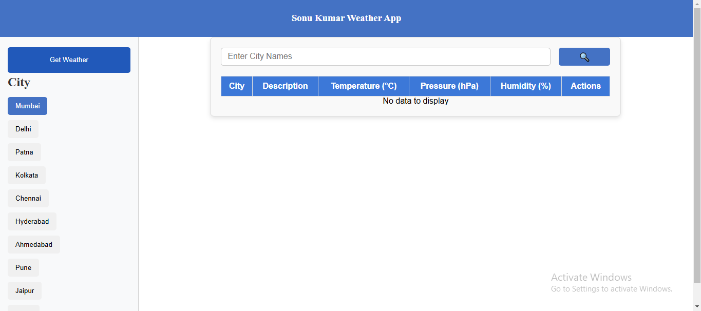
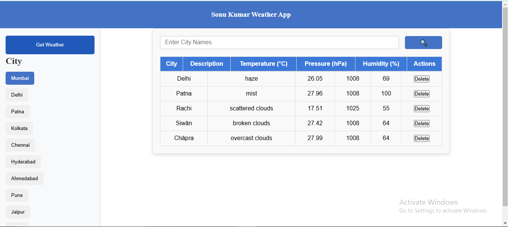

# Weather App

This is a simple and interactive weather app that provides current weather information for various cities. Built with React and CSS, it allows users to view real-time weather data by selecting a city from a predefined list.

## Table of Contents

- [Features](#features)
- [Tech Stack](#tech-stack)
- [Getting Started](#getting-started)
- [Screenshots](#screenshots)

## Features

- **Real-Time Weather Data**: Displays the current temperature, humidity, and weather conditions.
- **City Selection**: Allows users to select a city from a list.
- **Dynamic UI**: Updates the displayed weather data dynamically when a new city is selected.
- **Responsive Design**: Works well on both desktop and mobile devices.

## Tech Stack

- **Frontend**: React, JavaScript, CSS

- **Styling**: CSS Flexbox for responsive design

## Getting Started

Follow these instructions to set up the project on your local machine.

## Screenshots

# Weather_App
